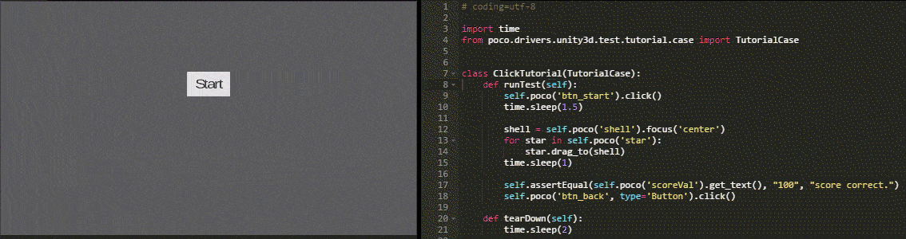

Welcome to Poco (ポコ) documentation!
===================================

**A cross-engine UI automation framework**. ``Unity3D``/``cocos2dx-*``/``Android native APP``/(Other engines SDK)/...

.. raw:: html

    <a href="https://github.com/AirtestProject/Poco" class="github-corner" aria-label="View source on Github">
        <svg width="120" height="120" viewBox="0 0 250 250" style="fill:#151513; color:#fff; position: fixed; top: 0; border: 0; right: 0;" aria-hidden="true">
            <path d="M0,0 L115,115 L130,115 L142,142 L250,250 L250,0 Z"></path>
            <path d="M128.3,109.0 C113.8,99.7 119.0,89.6 119.0,89.6 C122.0,82.7 120.5,78.6 120.5,78.6 C119.2,72.0 123.4,76.3 123.4,76.3 C127.3,80.9 125.5,87.3 125.5,87.3 C122.9,97.6 130.6,101.9 134.4,103.2" fill="currentColor" style="transform-origin: 130px 106px;" class="octo-arm"></path>
            <path d="M115.0,115.0 C114.9,115.1 118.7,116.5 119.8,115.4 L133.7,101.6 C136.9,99.2 139.9,98.4 142.2,98.6 C133.8,88.0 127.5,74.4 143.8,58.0 C148.5,53.4 154.0,51.2 159.7,51.0 C160.3,49.4 163.2,43.6 171.4,40.1 C171.4,40.1 176.1,42.5 178.8,56.2 C183.1,58.6 187.2,61.8 190.9,65.4 C194.5,69.0 197.7,73.2 200.1,77.6 C213.8,80.2 216.3,84.9 216.3,84.9 C212.7,93.1 206.9,96.0 205.4,96.6 C205.1,102.4 203.0,107.8 198.3,112.5 C181.9,128.9 168.3,122.5 157.7,114.1 C157.9,116.9 156.7,120.9 152.7,124.9 L141.0,136.5 C139.8,137.7 141.6,141.9 141.8,141.8 Z" fill="currentColor" class="octo-body"></path>
        </svg>
    </a>
    

.. raw:: html

    

        
        
            <a class="gh-btn" id="gh-btn" href="https://github.com/AirtestProject/Poco/fork" target="_blank" aria-label="Fork on GitHub">
                 Fork
            </a>
        
        
            <a class="gh-btn" id="gh-btn" href="https://github.com/AirtestProject/Poco" target="_blank" aria-label="Star on GitHub" style="margin-left:4px;">
                
                Star
            </a>
            <a class="gh-count" id="gh-count" href="https://github.com/AirtestProject/Poco/stargazers" target="_blank" aria-label="99+ stargazers on GitHub" style="display: block;">99+</a>
        
    

Getting Started
===============

.. toctree::
   :maxdepth: 2

   source/README

Install Poco and PocoSDK
------------------------

In order to use Poco, you must install Poco python library on your host and also install the `poco-sdk`_ in
your game/app.

**Poco** can be installed straightforward with ``pip`` command

.. code-block:: bash

    pip install pocoui

For **poco-sdk** integration please refer to `Integration Guide`_

Using Poco as Python package
============================

Simple demo
-----------

The following example shows a simple script on demo game using Unity3D. Check `More examples`_ section for more detailed
info.

First you should connect your Android phone, for example, via usb cable and enable the **ADB DEBUG MODE**.

.. code-block:: python

    # coding=utf-8

    import time
    from poco.drivers.unity3d import UnityPoco

    poco = UnityPoco()

    poco('btn_start').click()
    time.sleep(1.5)

    shell = poco('shell').focus('center')
    for star in poco('star'):
        star.drag_to(shell)
    time.sleep(1)

    assert poco('scoreVal').get_text() == "100", "score correct."
    poco('btn_back', type='Button').click()

Tools for writing test scripts
------------------------------

To retrieve the UI hierarchy of the game, please use our `AirtestIDE`_ (an IDE for writing test scripts) or
standalone `PocoHierarchyViewer`_ (to viewer the hierarchy and attributes only but lightweight) !

.. image:: source/doc/img/hunter-inspector.png

Tutorials and examples
----------------------

* `basic usage`_
* `interact with Buttons and Labels`_
* `drag and swipe operations`_
* `advanced selections`_
* `play with coordinate system and local positioning`_
* `iteration over elements`_
* `handling exceptions`_
* `waiting for events`_
* `play with unittest framework`_
* `optimize speed by freezing UI`_

.. _basic usage: source/doc/poco-example/basic.html
.. _interact with Buttons and Labels: source/doc/poco-example/interact_with_buttons_and_labels.html
.. _drag and swipe operations: source/doc/poco-example/drag_and_swipe_operations.html
.. _advanced selections: source/doc/poco-example/advanced_selections.html
.. _play with coordinate system and local positioning: source/doc/poco-example/play_with_coordinate_system_and_local_positioning.html
.. _iteration over elements: source/doc/poco-example/iteration_over_elements.html
.. _handling exceptions: source/doc/poco-example/handling_exceptions.html
.. _waiting for events: source/doc/poco-example/waiting_events.html
.. _play with unittest framework: source/doc/poco-example/play_with_unittest_framework.html
.. _optimize speed by freezing UI: source/doc/poco-example/optimize_speed_by_freezing_UI.html

API reference
=============

Poco API
--------

You can find all functions/methods for writing test scripts under the following links.

.. toctree::
    :maxdepth: 2

    Poco instance API <source/poco.pocofw>
    UI proxy object API <source/poco.proxy>
    Exceptions <source/poco.exceptions>

Engine specific API
'''''''''''''''''''

.. toctree::
    :hidden:

    Poco drivers (engine specific poco implementation) <source/doc/poco_drivers>

- `poco drivers (engine specific poco implementation) <source/doc/poco_drivers.html>`_

  - `Unity3D <source/poco.drivers.unity3d.unity3d_poco.html>`_
  - `Android native app <source/poco.drivers.android.uiautomation.html>`_
  - `cocos2dx-lua <source/poco.drivers.std.html>`_

..
 还没写完的连接先注释掉
 - `cocos2dx-js <source/poco.drivers.cocosjs.html>`_

Poco SDK API
''''''''''''

.. toctree::
    :maxdepth: 3

    Poco SDK API <source/poco.sdk>

.. toctree::
    :hidden:

    Examples and Tutorial <source/doc/poco-example/index>

.. toctree::
    :hidden:

    Project integration <source/doc/integration>

Dump UI hierarchy example
-------------------------

Poco defines an uniform format to serialize UI hierarchy for different game engines. This section shows how to dump
UI hierarchy.

.. code-block:: python

    import json
    from poco.drivers.unity3d import UnityPoco as Poco

    poco = Poco()
    ui = poco.agent.hierarchy.dump()
    print(json.dumps(ui, indent=4))

The following is the snippet of UI hierarchy. All UI elements are organized in `dict` representing the `tree` structure.
More detailed info about properties are described in
`.dumpHierarchy() <source/poco.sdk.AbstractDumper.html#poco.sdk.AbstractDumper.IDumper.dumpHierarchy>`_.

.. code-block:: python

    ...
    {
        "name": "OctopusArea",
        "payload": {
            "name": "OctopusArea",
            "type": "GameObject",
            "visible": true,
            "clickable": true,
            "zOrders": {
                "global": 0,
                "local": -10
            },
            "scale": [
                1,
                1
            ],
            "anchorPoint": [
                0.5,
                0.5
            ],
            "pos": [
                0.130729169,
                0.44907406
            ],
            "size": [
                0.0859375,
                0.125
            ]
        }
        "children": [
            {...},
            ...
        ],
    }
    ...

Join to discuss!
----------------

`join slack`_

.. _poco-sdk: source/doc/integration.html
.. _Integration Guide: source/doc/integration.html
.. _Integration Guide for NetEase: source/doc/integration.html#netease-internal-engines
.. _More examples: source/doc/poco-example/index.html
.. _Hunter内嵌inspector: source/doc/hunter-inspector-guide.html
.. _网易游戏项目测试脚本标准模板: source/doc/netease-internal-use-template.html
.. _android-native: http://poco.readthedocs.io/en/latest/source/doc/poco_for_android_native_app.html
.. _PocoUnit: https://github.com/AirtestProject/PocoUnit
.. _PocoHierarchyViewer: source/doc/about-standalone-inspector.html
.. _AirtestIDE: http://airtest.netease.com/

.. _join slack: https://join.slack.com/t/airtestproject/shared_invite/enQtMzYwMjc2NjQzNDkzLTcyMmJlNjgyNjgzZTRkNWRiYmE1YWI1ZWE5ZmQwYmM1YmY3ODZlMDc0YjkwMTQ5NDYxYmEyZWU1ZTFlZjg3ZjI
