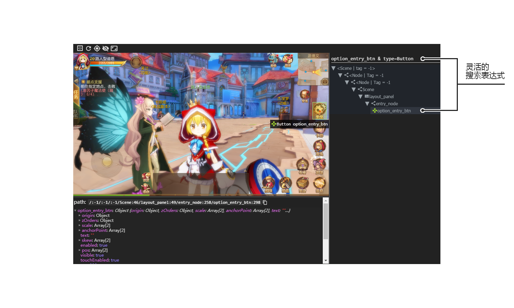

# Poco ポコ

**A cross-engine UI Automation Framework**

[中文README(Chinese README)](README-CN.md)在此。

## Installation

To use `poco` full functionality (Netease internal engine implementations), please install the following modules with scripts given below before installing `poco`.

```sh
# airtest runtime
git clone ssh://git@git-qa.gz.netease.com:32200/gzliuxin/airtest.git
pip install -e airtest

# aircv for airtest
git clone -b open-source ssh://git@git-qa.gz.netease.com:32200/airtest-projects/aircv.git
pip install -e aircv

# hrpc
git clone ssh://git@git-qa.gz.netease.com:32200/maki/hrpc.git
pip install -e hrpc

# hunter-cli
git clone ssh://git@git-qa.gz.netease.com:32200/maki/hunter-cli.git
pip install -e hunter-cli

# hunter lib for airtest
git clone ssh://git@git-qa.gz.netease.com:32200/maki/airtest-hunter.git
pip install -e airtest-hunter
```

Install `poco` and `PocoUnit` for unittest.

```sh
# poco
git clone ssh://git@git-qa.gz.netease.com:32200/maki/poco.git
pip install -e poco

# poco unittest framework
git clone ssh://git@git-qa.gz.netease.com:32200/maki/PocoUnit.git
pip install -e PocoUnit
```


## Basic Concepts

**Target device**: A host that the app/game running on. Usually a PC or a cell phone.  
**UI proxy**: An object in poco that represents zero, one or more than one UI element(s) in target app/game. A proxy object acts as an intermediary between the test code and UI elements represent.  
**UI element/node**: An object in app's/game's runtime which is rendered on screen. That is what we call the UI as usual.  
**Query condition/expression**: A serializable object for poco to select specific UI element. It is a nested tuple by default. This is handled by poco that developers/testers do not need to care its internal structure, unless you are going to customize your own `Selector`.  





### Definition of coordinate system and metric space


#### UniformCoordinateSystem

To measure position or dimension in poco, we use a new scale of coordinates called UniformCoordinateSystem. UniformCoordinateSystem normalizes the metric space that width or length of screen always measures unit one, the top left corner of screen is the origin, right direction is x-axis, down direction is y-axis. This helps you to write cross-resolution code and makes you never care about the hundreds of different resolution devices.

The scales are average of each axis that the center is always (0.5, 0.5). Scalars and vectors are easily deduced.

#### LocalCoordinateSystem

Bounding box indicates the coordinate (x, y) range of the **first** selected UI element of UI proxy. The top left corner is the origin of LocalCoordinateSystem, right direction is x-axis, down direction is y-axis. The width or height in LocalCoordinateSystem always measures unit one. Besides, other definitions are similar to UniformCoordinateSystem.

LocalCoordinateSystem helps you locate accurately and flexibly inside UI element. (0.5, 0.5) in LocalCoordinate represents the center of the UI element.

## Interaction with UI

### Poco instance initialization

Initialization for each engine implementations are different. Take Unity3D as example. Other engines see:

* [cocos2dx-js]()
* [android-native]()
* unreal (in development)
* (others see [INTEGRATION guide]() for more details)


```python
from poco.vendor.unity3d import UnityPoco

poco = UnityPoco()
ui = poco('...')
```

### Selection

Add a pair of brackets after `poco` instance to select UI element with given arguments as query condition. This expression always returns a UI proxy. A UI proxy also has some selection methods which return another UI proxy so that the selection can be chained. 

#### Basic selection

There are many types of query conditions. Basic selection are only to select UI elements that satisfy the given attribute condition. 

```python
# select by name (Select by the attribute named 'name' of UI element.)
poco('bg_mission')

# the same as above (The first parameter are name attribute)
poco(name='bg_mission')

# select by multiple attributes
poco('bg_mission', type='Button')

# select by multiple attributes with regular expression matching comparison
# add 'Matches' following by attribute name indicates using regular expression matching comparison rather than equivalence comparison
poco(textMatches='^据点.*$', type='Button', enable=True)
```


#### Parenting relative selection

For a tree-like UI hierarchy, It is also available to select UI elements based on hierarchical relationships (kinship). These selector are methods of UI proxy. Each method can be treated as a basic selector.

```python
# Straight children/Descendants including children
poco('main_node').child('list_item').offspring('item')
```
``


```python
# sibling for brother nodes
poco('main_node').child('list_item').sibling('tab_top')
```

#### Sequential index selection

Select the specific one from all UI elements as a new UI proxy. The sequence/index is related to space arrangement. It is always from left to right, from top to bottom, regardless of its sequence in the hierarchy tree.

```python
items = poco('main_node').child('list_item').offspring('item')
print(items[0].child('material_name').get_text())
print(items[1].child('material_name').get_text())
```


### Iteration over UI elements

Iteration sequence is the same as sequential index selection. If position changed or UI element rearranged during the iteration, the sequence will not change. Once the iteration begins, all iteratees are fixed. That means all of the UI elements selected at this moment will be iterated over except recycled by engine. Iteration stops immediately When iterating on UI element that is recycled.  

```python
# iterate over each item
items = poco('main_node').child('list_item').offspring('item')
for item in items:
    item.child('icn_item')
```


### Retrieving attribute values


```python
mission_btn = poco('bg_mission')
print(mission_btn.attr('type'))  # 'Button'
print(mission_btn.get_text())  # '据点支援'
print(mission_btn.attr('text'))  # '据点支援', equvilent to `.get_text()`
print(mission_btn.exists())  # True, whether or not it's rendered on screen
```

### Actions

Performing actions are simulating and injecting a motion event or key event to the target device. All actions will only apply at the **first** UI element of the UI proxy. If multiple UI elements selected, others except the first will be ignored.

For easy maintenance, you'd better select unique UI element before performing actions.
 
```python
# only the first element
proxy.action() <=> proxy[0].action()
```

#### Click

Perform an action of the **first** UI element selected by UI proxy.

```python
poco('bg_mission').click()
poco('bg_mission').click('center')
poco('bg_mission').click([0.5, 0.5])  # quivilent above
poco('bg_mission').focus([0.5, 0.5]).click()  # quivilent above
```


#### Swipe

Start from focus point of UI proxy, move your finger to a given direction measured by vector.

```python
joystick = poco('movetouch_panel').child('point_img')
joystick.swipe('up')
joystick.swipe([0.2, -0.2])  # 45 deg towards top right
joystick.swipe([0.2, -0.2], duration=0.5)
```


#### Drag
 
Similar to `swipe`, but the movement is specified by another UI proxy.

```python
poco(text='突破芯片').drag_to(poco(text='岩石司康饼'))
```


#### Focus (Local positioning, not setting focus on text input.)

Set a focus point related to selected UI element. This is not going to change the attribute of UI element, but create a new UI proxy with given focus point. When perform actions on the UI proxy, the major action point is the focus point. The coordinate of focus point can be larger than 1 or smaller than 0 that indicates outside the bounding box. The default focus point is the anchor of UI element (position of UI element).

Take `click` as example, the following shows clicking the center of UI element whose name is 'bg_mission'.

```python
poco('bg_mission').focus('center').click()  # click the center of UI element whose name is 'bg_mission'
```

`focus` can also be used within the same UI proxy and simulate scroll action using `drag`.

```
scrollView = poco(type='ScollView')
scrollView.focus([0.5, 0.8]).drag_to(scrollView.focus([0.5, 0.2]))
```


#### Wait

Wait until UI element appears or timeout. This method always return the UI proxy itself not a new one.

```python
poco('bg_mission').wait(5).click()  # wait at most 5s, click at once 'bg_mission' appears within 5s
poco('bg_mission').wait(5).exists()  # wait at most 5s
```

## Exceptions

```python
from poco.exceptions import PocoTargetTimeout

try:
    poco('guide_panel', type='ImageView').wait_for_appearance()
except PocoTargetTimeout:
    # bugs here as the panel not shown
    raise
```

```python
from poco.exceptions import PocoNoSuchNodeException

img = poco('guide_panel', type='ImageView')
try:
    if not img.exists():
        img.click()
except PocoNoSuchNodeException:
    # perform actions on non-existence UI element will raise this exception
    pass
```

## Assertions

Assertions are part of the unittest. Poco is automation framework. For unittest, see [PocoUnit](http://git-qa.gz.netease.com/maki/PocoUnit). PocoUnit provides a full set of assertions methods and it is drop in with python stdlib unittest.

## Ingrations guide

See [INTEGRATION guide](). This guide helps you implement and integrate poco-sdk with your app step by step.

## LICENSE

TODO
