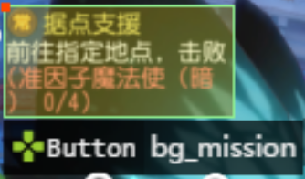
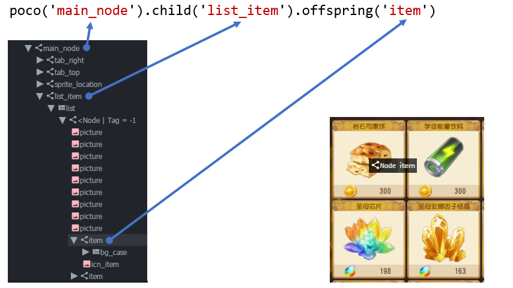
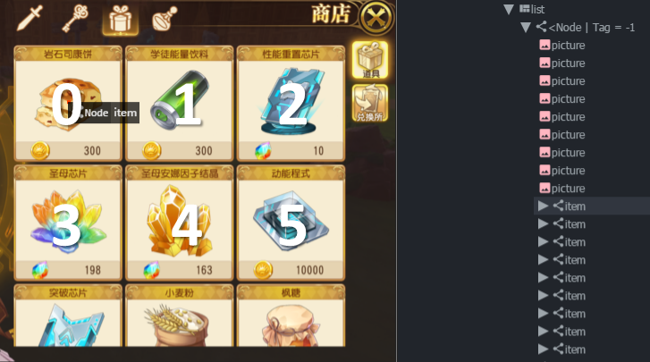
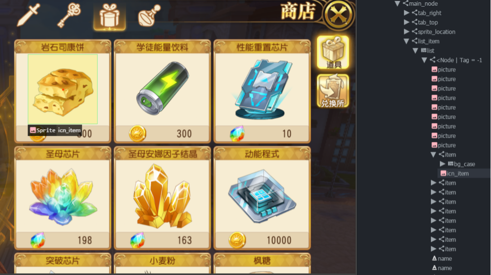
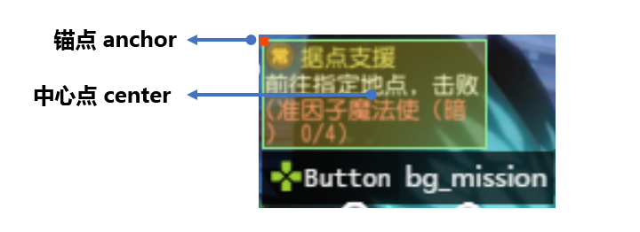
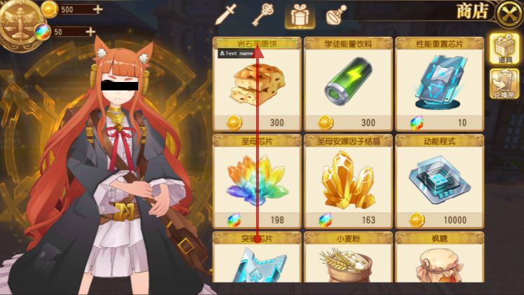
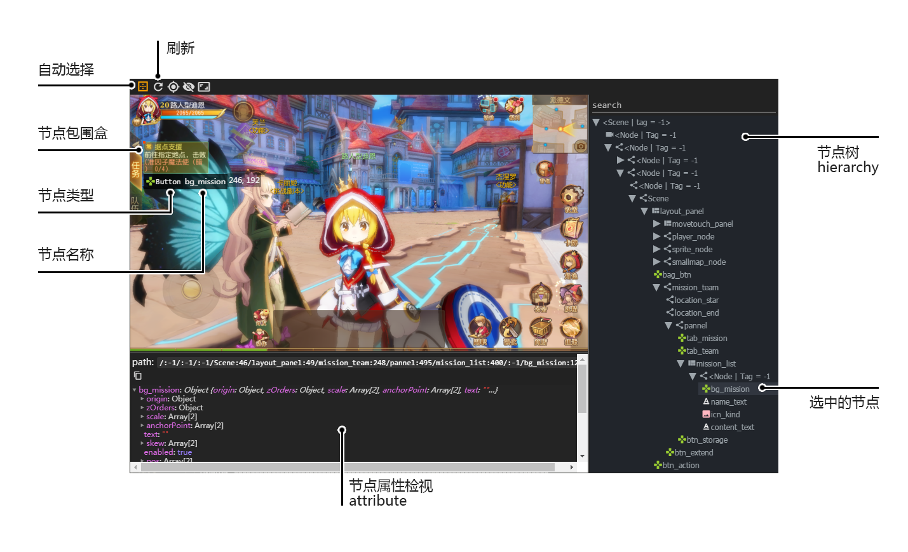
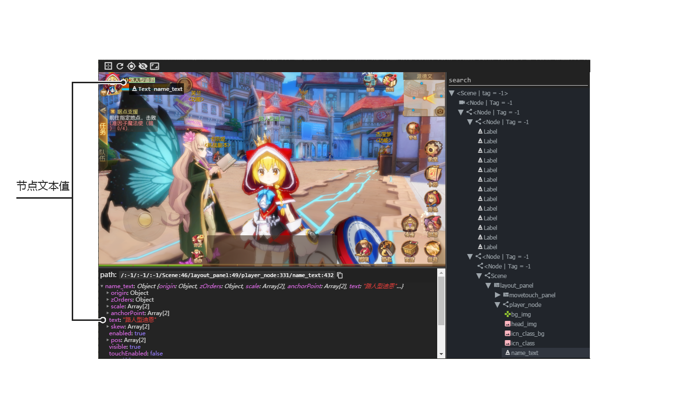
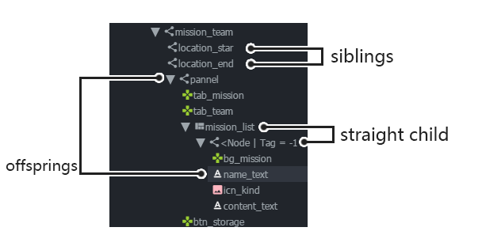
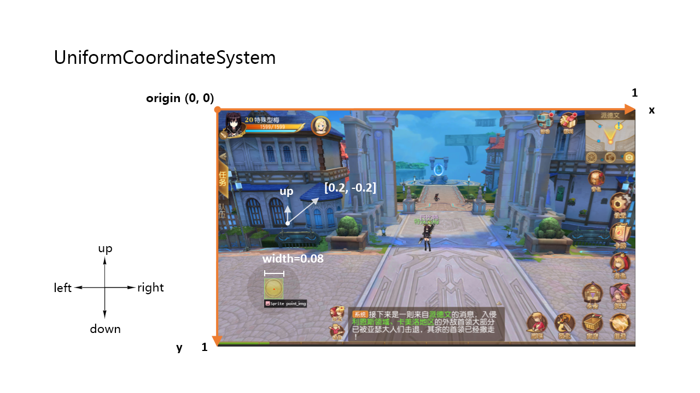

Poco ポコ
=======

**A cross-engine UI automation framework**

Example
-------

.. image:: doc/img/overview.gif

.. code-block:: python

    # coding=utf-8

    import time
    from poco.drivers.unity3d import UnityPoco
    from airtest.core.api import connect_device

    # you should connect an Android device to your PC/mac
    # and set the ip address of your Android device
    connect_device('Android:///')
    poco = UnityPoco(('10.254.44.76', 5001))

    poco('btn_start').click()
    time.sleep(1.5)

    shell = poco('shell').focus('center')
    for star in poco('star'):
        star.drag_to(shell)
    time.sleep(1)

    assert poco('scoreVal').get_text() == "100", "score correct."
    poco('btn_back', type='Button').click()

`More examples`_ here.

Tools for writing test scripts
------------------------------

To retrieve the UI hierarchy of the game, please use our `AirtestIDE`_ (an IDE for writing test scripts) or
standalone `PocoHierarchyViewer`_ (to viewer the hierarchy and attributes only but lightweight) !

Features
--------

Main Poco features includes following:

* supports mainstream game engines, including: Unity3D, cocos2dx-js, cocos2dx-lua and Android native apps
* retrieves UI Elements Hierarchy in game's runtime
* is super fast and impact-free to the game
* allows straightforward SDK integration to the game (within in 5 minutes)
* provides powerful APIs taht are engine independent
* supports multi-touch e.g. fling/pinch/... (and more is coming soon)
* support gps, accelerometer and gyro sensors, rotation (landscape/portrait) and other sensors as input (coming soon)
* is extensible to other private engines by implementing `poco-sdk`_ .
* is compatible with Python 2.7 and Python 3.3+.

Installation
------------

In order to use Poco, you must install Poco python library on your host and also install the `poco-sdk`_ in
your game/app.

**Poco** can be installed straightforward with ``pip`` command

.. code-block:: bash

    pip install pocoui

For NetEase internal use, run the following command directly.

.. code-block:: bash

    pip install -i https://pypi.nie.netease.com/ airtest-hunter pocoui pocounit

SDK Integration
---------------

For **poco-sdk** integration please refer to `Integration Guide`_

Documentation
-------------

`Online docs`_.

How to use Poco
---------------

Poco supports different types of engines by different drivers. For different engines please initialize ``poco`` instance
by corresponding driver.

Following example shows how to initialize popo instance for

* Unity3D.

.. code-block:: python

    from poco.drivers.unity3d import UnityPoco
    from airtest.core.api import connect_device

    # you should connect an Android device to your PC/mac
    # and set the ip address of your Android device
    connect_device('Android:///')
    poco = UnityPoco(('<ip of device>', 5001))

    # for windows
    # poco = UnityPoco(('localhost', 5001), editor_mode=True)

    ui = poco('...')
    ui.click()

* `NetEase Internal Engines <poco.drivers.netease.internal.html>`_ except for Unity3D projects.

.. code-block:: python

    from poco.drivers.netease.internal import NeteasePoco
    from airtest.core.api import connect_device

    # 先连上android设备
    connect_device('Android:///')

    # windows的话这样
    # connect_device('Windows:///?title_re=^.*errors and.*$')  # 无需urlencode

    poco = NeteasePoco('g37')  # hunter上的项目代号
    ui = poco('...')
    ui.click()

* `cocos2dx-js`_
* `android-native`_
* unreal (in development)
* for other engines, refer to `Integration guide`_ for more details

Working with Poco Objects
-------------------------

Basic Selector
""""""""""""""

UI element objects can be selected by invoking ``poco(...)`` function instance. The function traverses through the
render tree structure and selects all the corresponding UI elements matching the query expression.

The function takes one mandatory argument `node name`, the optional arguments can be substituted too and they refer to
specific node properties. For more information, refer to API reference.

.. code-block:: python

    # select by node name
    poco('bg_mission')
    
    # select by name and other properties
    poco('bg_mission', type='Button')
    poco(textMatches='^据点.*$', type='Button', enable=True)

Relative Selector
"""""""""""""""""

When there is any ambiguity in the selected objects by node names/node types or object unable to select, the relative
selector tries to select the element object by hierarchy in following manner

.. code-block:: python

    # select by direct child/offspring
    poco('main_node').child('list_item').offspring('item')

Sequence Selector
"""""""""""""""""

Tree indexing and traversing is performed by default from up to down or from left to right. In case that
the 'not-yet-traversed' nodes are removed from the screen, the exception is raised. The exception is not raised in case
when the 'already-traversed' nodes are removed and in this case the traversing continues in previous order despite
the fact that the nodes in views were rearranged during the travers process.

.. code-block:: python

    items = poco('main_node').child('list_item').offspring('item')
    print(items[0].child('material_name').get_text())
    print(items[1].child('material_name').get_text())

Iterate over a collection of objects
""""""""""""""""""""""""""""""""""""

Following code snippet shows how to iterate over the collection of UI objects

.. code-block:: python

    # traverse through every item
    items = poco('main_node').child('list_item').offspring('item')
    for item in items:
        item.child('icn_item')

Get object properties
"""""""""""""""""""""

Following examples shows how to obtain various properties of an object

.. code-block:: python
    
    mission_btn = poco('bg_mission')
    print(mission_btn.attr('type'))  # 'Button'
    print(mission_btn.get_text())  # '据点支援'
    print(mission_btn.attr('text'))  # '据点支援' equivalent to .get_text()
    print(mission_btn.exists())  # True/False, exists in the screen or not

Object Proxy Related Operation
""""""""""""""""""""""""""""""

This section describes object proxy related operations

click
'''''

The anchorPoint of UI element is attached to the click point by default. When the first argument
(the relative click position) is passed to the function, the coordinates of the top-left corner of the bounding box
become ``[0, 0]`` and the bottom right corner coordinates are ``[1, 1]``. The click range area can be less than 0 or
larger than 1. If the click range area lies in the interval (0, 1), it means it is beyond the bounding box.

Following example demonstrates how to use ``click`` function

.. code-block:: python

    poco('bg_mission').click()
    poco('bg_mission').click('center')
    poco('bg_mission').click([0.5, 0.5])    # equivalent to center
    poco('bg_mission').focus([0.5, 0.5]).click()  # equivalent to above expression

swipe
'''''

The anchorPoint of UI element is taken as the origin, the swipe action is performed towards the given direction with
the certain distance.

Following example shows how to use the ``swipe`` function

.. code-block:: python

    joystick = poco('movetouch_panel').child('point_img')
    joystick.swipe('up')
    joystick.swipe([0.2, -0.2])  # swipe sqrt(0.08) unit distance at 45 degree angle up-and-right
    joystick.swipe([0.2, -0.2], duration=0.5)

.. image:: doc/img/hunter-poco-swipe.png

drag
''''
 
Drag from current UI element to the target UI element.

Following example shows how to use the ``drag_to`` function

.. code-block:: python

    poco(text='突破芯片').drag_to(poco(text='岩石司康饼'))

focus (local positioning)
'''''''''''''''''''''''''

The anchorPoint is set as the origin when conducting operations related to the node coordinates. If the the local click
area is need, the focus function can be used. The coordinate system is similar to the screen coordinates - the origin
is put to the top left corner of the bounding box and with length of unit of 1, i.e the coordinates of the center are
then ``[0.5, 0.5]`` and the bottom right corner has coordinates ``[1, 1]``.

.. code-block:: python

    poco('bg_mission').focus('center').click()  # click the center

The focus function can also be used as internal positioning within the objects. Following example demonstrates the implementation of `scroll` operation in `ScrollView`.

.. code-block:: python

    scrollView = poco(type='ScollView')
    scrollView.focus([0.5, 0.8]).drag_to(scrollView.focus([0.5, 0.2]))

wait
''''

Wait for the target objects to appear on the screen and return the object proxy itself. If the object exists, return
immediately.

.. code-block:: python

    poco('bg_mission').wait(5).click()  # wait 5 seconds at most，click once the object appears
    poco('bg_mission').wait(5).exists()  # wait 5 seconds at most，return Exists or Not Exists

Global Operation
""""""""""""""""

`Poco` framework also allows to perform the operations without any UI elements selected. These operations are called
`global` operations.

click
'''''

.. code-block:: python

    poco.click([0.5, 0.5])  # click the center of screen
    poco.long_click([0.5, 0.5], duration=3)

swipe
'''''

.. code-block:: python

    # swipe from A to B
    point_a = [0.1, 0.1]
    center = [0.5, 0.5]
    poco.swipe(point_a, center)
    
    # swipe from A by given direction
    direction = [0.1, 0]
    poco.swipe(point_a, direction=direction)

snapshot
''''''''

Take a screenshot of the current screen in base64 encoded string. The image format depends on the sdk implementation.
Take a look at :py:meth:`ScreenInterface.getScreen <poco.sdk.interfaces.screen.ScreenInterface.getScreen>`
to dive into sdk implementation details.

**Note**: ``snapshot``  is not supported in some engine implementation of poco.

.. code-block:: python

    from base64 import b64decode
    
    b64img, fmt = poco.snapshot(width=720)
    open('screen.{}'.format(fmt), 'wb').write(b64decode(b64img))

Exceptions
----------

This sections describes the Poco framework errors and exceptions.

PocoTargetTimeout
"""""""""""""""""

.. code-block:: python

    from poco.exceptions import PocoTargetTimeout
    
    try:
        poco('guide_panel', type='ImageView').wait_for_appearance()
    except PocoTargetTimeout:
        # bugs here as the panel not shown
        raise

PocoNoSuchNodeException
"""""""""""""""""""""""

.. code-block:: python

    from poco.exceptions import PocoNoSuchNodeException
    
    img = poco('guide_panel', type='ImageView')
    try:
        if not img.exists():
            img.click()
    except PocoNoSuchNodeException:
        # If attempt to operate inexistent nodes, an exception will be thrown
        pass

Unit Test
---------

Poco is an automation test framework. For unit testing, please refer to `PocoUnit`_ section. PocoUnit provides a full 
set of assertion methods and furthermore, it is also compatible with the ``unittest`` in Python standard library.

Some Concepts
-------------

This section describes some basic concepts of Poco. Basic terminology used in following section

* **Target device**: test devices where the apps or games run on, it usually refers to mobile phone devices
* **UI proxy**: proxy objects within Poco framework, they represent zero (none), one or multiple in-game UI elements
* **Node/UI element**: UI element instances or nodes in app/game
* **query expression**: a serializable internal data structure through which Poco interacts with **target devices** and
  selects the corresponding UI elements. It is not usually needed to pay much attention to this unless it is required
  to customize the ``Selector`` class.

Following images show the UI hierarchy represented in Poco

Definitions of coordinate system and metric space
"""""""""""""""""""""""""""""""""""""""""""""""""

Normalized Coordinate System
''''''''''''''''''''''''''''

In normalized coordinate system, the origin (0, 0) lies on top left corner of the device display. The height and the
width of the screen are chosen as 1 unit of length, refer to image below for more detailed information.
In normalized coordinate system, the same UI elements on the devices with different resolution have always the same
position and size. This is especially very handy when writing cross-device test cases.

The space of normalized coordinate system is uniformly distributed, i.e. the coordinates of the screen center are
(0.5, 0.5) and the computing method of other scalars and vectors are all same in Euclidean space.

Local Coordinate System (local positioning)
'''''''''''''''''''''''''''''''''''''''''''

The aim of introducing local coordinate system is to express the coordinates with reference to a certain UI elements.
The origin (0,0) of local coordinate system lies on the top left corner of UI bounding box, x-axis goes horizontally
rightward direction and y-axis goes vertically downwards. The height and the width of UI element are chosen as 1 unit of
length. Coordinates are expressed as signed distances from the origin. Other definitions are same as for normalized
coordinate system.

Local coordinate system is more flexible in order to locate the position within or outside of UI element, e.g
the coordinates at (0.5, 0.5) corresponds to the center of the UI element while coordinates larger than 1 or less than 0
correspond to the position out of the UI element.

..
 下面的连接要替换成绝对路径

.. _中文README(Chinese README): 
.. _poco-sdk: doc/integration.html
.. _Integration Guide: doc/integration.html
.. _More examples: doc/poco-example/index.html
.. _PocoUnit: http://git-qa.gz.netease.com/maki/PocoUnit
.. _AirtestIDE: 下载链接
.. _PocoHierarchyViewer: http://init.nie.netease.com/downloads/poco/PocoHierarchyViewer-win32-x64.zip

.. _API Reference: http://init.nie.netease.com/autodoc/poco/doc-auto/index.html#api-reference
.. _Online docs: http://init.nie.netease.com/autodoc/poco/doc-auto/index.html

..
 下面是对应sdk的下载链接

.. _cocos2dx-js:
.. _android-native:
