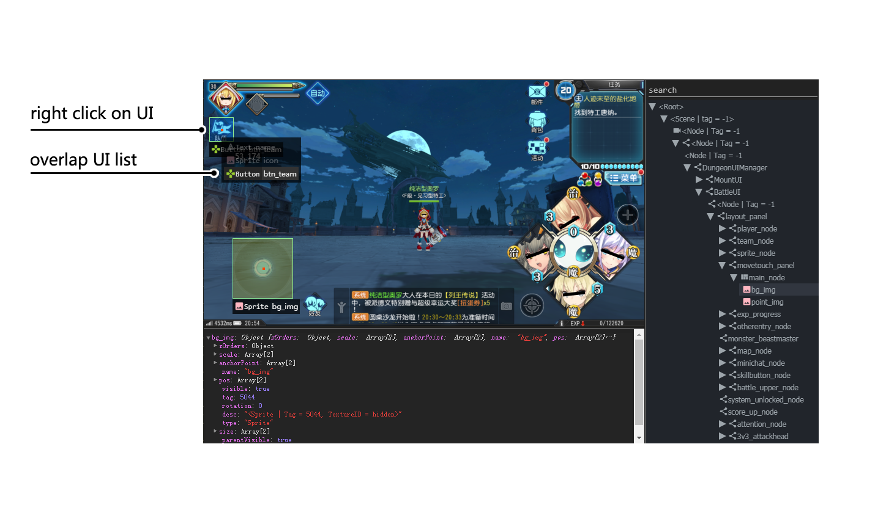

Hierarchy viewer (UI Inspector)
===============================

As poco dives into UI controls, it is very necessary to get to know the UI structure of testing game/app when writing
test script. The hierarchy viewer will do a lot help.

The standalone hierarchy viewer now supports android native apps and Unity3D games (with poco-sdk integrated).

Download
--------

- `Hierarchy viewer for windows`_
- `Hierarchy viewer for mac`_

How to use
----------

When you placing the mouse pointer over, it will auto detect a bounding box for proper UI controls.

.. image:: img/hunter-inspector.png
.. image:: img/hunter-inspector-text-attribute.png

If multiple UI controls overlap, right click and a list of all overlap UI controls will be shown. If you want to view
non-interactive UI, just right click with shift key.

.. _Hierarchy viewer for windows: http://top.gdl.netease.com/poco-res/PocoHierarchyViewer-win32-x64.zip
.. _Hierarchy viewer for mac: TODO.fix.the.link
