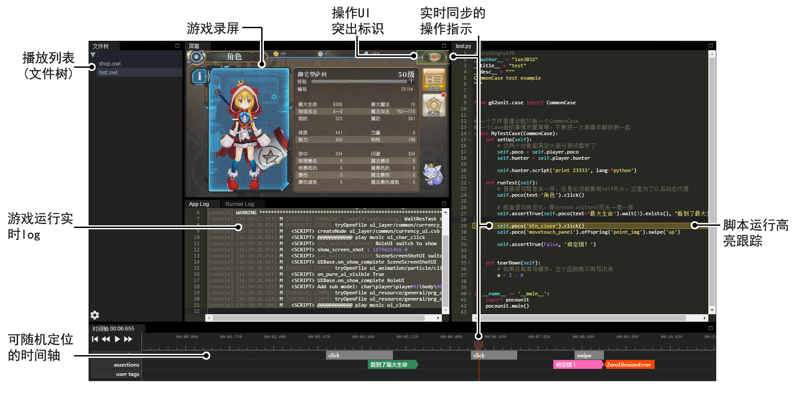
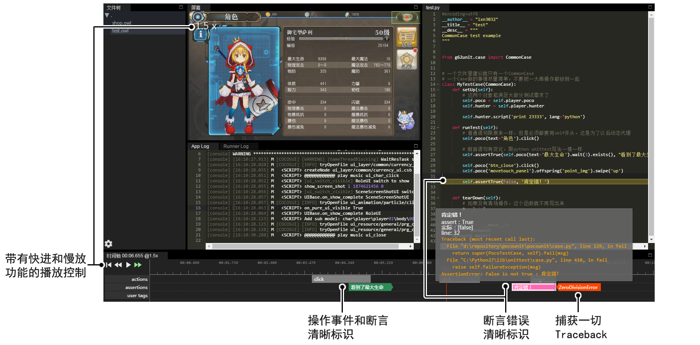

Test Result Player
==================

The test result player can replay the whole procedure of the test case written under `pocounit framework`_. Simply open
the test case folder and you can start to play the test. It very powerful for test engineers to spot the bugs
quickly.

This tool should use together with ``pocounit``. More information refers to `pocounit framework`_.

Download
--------

- `PocoTestResultPlayer for windows`_
- `PocoTestResultPlayer for mac`_

.. _PocoTestResultPlayer for windows: http://top.gdl.netease.com/poco-res/PocoTestResultPlayer-win32-x64.zip
.. _PocoTestResultPlayer for mac: TODO.fix.the.link
.. _pocounit framework: https://github.com/AirtestProject/PocoUnit
