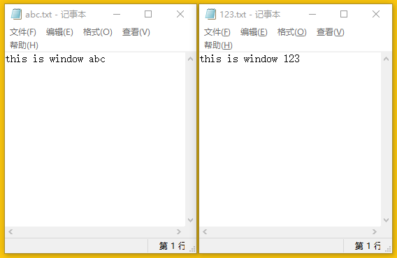
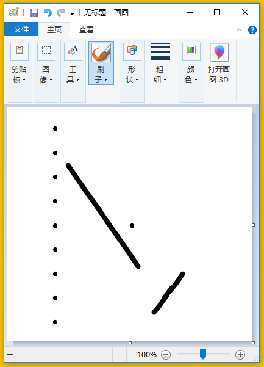

Windows app (poco driver)
=========================

This page will teach you how to use Poco to test your windows programs.
To test your program is very simple, just follow the steps below.

.. note::

    Only some GUI programs developed by Windows native framework are supported.
    Such as MFC, WindowsForm, WPF, Modern UI(Metro UI), Qt(partly), IE, Firefox ...

Dependency
----------

To run Windows Poco SDK, you need to install the following library.

**pip install pywin32**

**pip install uiautomation**

Initialize a Poco instance
--------------------------

First you need to initialize a Poco instance. Remember to import the poco library first.
The first parameter is a dictionary that determines which window you want to test. 
The second parameter is an address that identifies the machine on which the program you are testing is located. 
The default is the local machine.

Currently, there are three ways to search for windows.

1. ``title`` Find windows by title. 
#. ``handle`` Find windows by handle.
#. ``title_re`` Find windows by regular expression of title

You can use it with the following example

.. code-block:: python

    from poco.drivers.windows import WindowsPoco
    poco = WindowsPoco({"title": "YourWindowTitle"})  # Find windows by title in local machine
    # poco = WindowsPoco({"title_re": "[a][b][c]"}, ("192.168.1.10", 15004))  # Find windows by regular expression remotely
    # poco = WindowsPoco({"handle": 123456}) # Find windows by handle

Poco also supports **testing multiple windows** at the same time. You only need to provide different addresses for
different poco instances.

.. code-block:: python

    from poco.drivers.windows import WindowsPoco
    # import time
    poco1 = WindowsPoco({"title_re": "[0-9][0-9][0-9]"}, ("localhost", 10086))
    poco2 = WindowsPoco({"title_re": "[a][b][c]"}, ("localhost", 10087))
    poco1("文本编辑器").set_text("this is window 123")
    poco2("文本编辑器").set_text("this is window abc")
    time.sleep(1)  # wait for the server to finish processing and exit gracefully

.. Warning::

    If the parameters you provide cannot locate a unique window, an error will be reported. For example, a regular
    expressions as you provide may match multiple windows.

.. note::
    The winows driver has integrated the WindowsUI SDK. If you are testing a local program, 
    you can start the driver directly. If you are testing a remote program, you will need to launch the WindowsUI SDK
    service on the remote machine.

Start testing your program
--------------------------

After initializing the poco instance, you can test your program.
Just like other engines, you can simulate the various inputs of your device through Poco's own functions, such as
``click``, ``long_click``, ``swipe``, ``snapshot``. See `object proxy related operation`_ for more details.

Here is an simple example.

.. code-block:: python

    from poco.drivers.windows import WindowsPoco
    poco = WindowsPoco({"title_re": ".+?画图$"})
    for p in range(1, 10):
        poco("Pane").child("Pane").click([0.2, p / 10.0])
    poco("Pane").child("Pane").click()  # will draw a point in the middle
    poco("Pane").child("Pane").focus([0.25, 0.25]).drag_to([0.5, 0.7])
    poco("Pane").child("Pane").focus([0.7, 0.7]).swipe([-0.1, 0.1])

.. note::
    If you don't know the name of the UI control in the window, you can check it out through our
    `Poco Hierarchy Viewer (UI Inspector)`_

.. _object proxy related operation: http://poco.readthedocs.io/en/latest/source/README.html#object-proxy-related-operation
.. _Poco Hierarchy Viewer (UI Inspector): https://poco.readthedocs.io/en/latest/source/doc/about-standalone-inspector.html