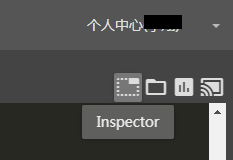

Hunter 内嵌Inspector
==================

在Hunter中配置好poco模块后，终端界面就会出现下面的图标了。Hunter中配置poco请见 `Integration Guide for NetEase`_ .

.. _Integration Guide for NetEase: integration.html#netease-internal-engines
