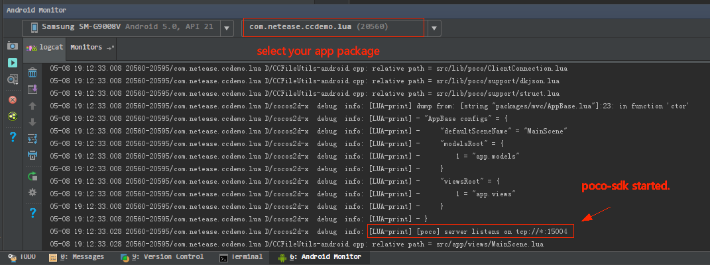
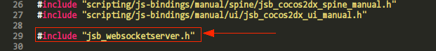
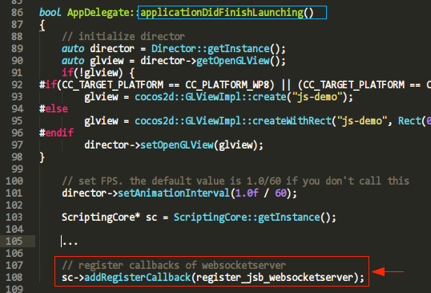
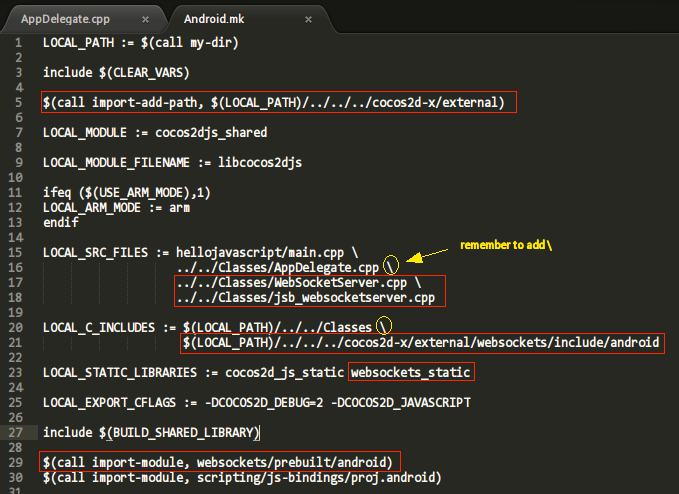

PocoSDK Integration Guide
=========================

PocoSDK implementations for most popular game engines are already provided in `poco-sdk repo`_. You can easily integrate PocoSDK in your game following the corresponding instruction.

Feel free to open an issue if you get stuck in integration.

Unity3D
-------
PocoSDK supports Unity3D version 4 & 5, ngui & ugui, C# only for now. If your game is not supported yet, please refer to `implementation guide <implementation_guide.html>`_.

1. Clone source code from `poco-sdk repo`_. 
#. Copy the ``Unity3D`` folder to your unity project script folder.
#. If you are using ``ngui``, just remove the sub folder ``Unity3D/ugui`` . If you are using ``ugui``, just remove the sub folder ``Unity3D/ngui`` .
#. Add ``Unity3D/PocoManager.cs`` as script component on any ``GameObject``, generally on main camera.

Cocos2dx-lua
------------

PocoSDK supports cocos2dx-lua version >= 3.1.

1. Clone the sdk source code from `poco-sdk repo`_.
#. Copy the ``cocos2dx-lua/poco`` folder to your project script folder. You can rename the folder if you wish.
#. Initialize poco-sdk by copying following code to your game initialization script.

.. code-block:: lua

    local poco = require('poco.poco_manager')
    poco:init_server(15004)  -- default port number is 15004, change to another if you like

.. note::

    Your cocos2dx-lua project should at least enable ``socket`` or ``socket.core`` module, as poco requires this module
    to setup a tcp server at runtime.

.. note::

    If your cocos2dx-lua project does not have ``mime`` module, it still works but a little slow.

4. Check the adb logcat (for Android) whether successfully integrated. (It is highly recommended to use Android Studio.)
   If you can see the following "LUA-print", you poco-sdk is successfully integrated.

After integration, you can start to `play with poco`_. Or if you have any problems, feel free to `open an issue here`_.
**Title format: [cocos2dx-lua sdk integration] xxx**

Cocos2dx-js (beta)
------------------

PocoSDK supports 3.1 <= Cocos2dx version <= 3.13.1 (theoretically). To make sure compatibility across every javascript
engines, the javascript sdk is written in ES5.

cocos2d-x 3.13.1 is tested and passed.

1. Clone sdk source code from `poco-sdk repo`_. 
#. Copy the ``cocos2dx-js/Poco`` folder to your cocos project javascript folder.
#. As sdk requires WebSocketServer, we should build WebSocketServer module and js bindings in native code.
   The WebSocketServer is part of cocos2dx framework but not include by default thus we build it manually by following
   steps. See also `WebSocketServer reference`_. You'd better backup your origin ``websockets`` folder before copying.
   The js binding for WebSocketServer requires libwebsockets version == 1.6. There may be some incompatibility issues
   in cocos2d-x itself if your cocos2d-x engine is not using libwebsockets version == 1.6.

.. code-block:: bash

    cp -r cocos2dx-js/3rd/websockets <your-cocos-project>/frameworks/cocos2d-x/external/websockets
    cp cocos2dx-js/3rd/src/* <your-cocos-project>/frameworks/runtime-src/Classes

4. Edit ``<your-cocos-project>/frameworks/runtime-src/Classes/AppDelegate.cpp``. Add
   following 2 lines at proper position respectively.

.. code-block:: cpp

    // include it at top
    #include "jsb_websocketserver.h"

    // register callbacks of websocketserver
    sc->addRegisterCallback(register_jsb_websocketserver);

5. Edit ``<your-cocos-project>/frameworks/runtime-src/proj.android/jni/Android.mk``.
   Add following boxed line at proper position in your own makefile.
   If you are using AndroidStudio project, edit ``proj.android-studio/jni/Android.mk`` and ensure the path is correct.

.. code-block:: text

    ...

    $(call import-add-path, $(LOCAL_PATH)/../../../cocos2d-x/external)

    LOCAL_SRC_FILES := hellojavascript/main.cpp \
                       ../../Classes/AppDelegate.cpp \
                       ../../Classes/WebSocketServer.cpp \
                       ../../Classes/jsb_websocketserver.cpp

    LOCAL_C_INCLUDES := $(LOCAL_PATH)/../../Classes \
                        $(LOCAL_PATH)/../../../cocos2d-x/external/websockets/include/android

    LOCAL_STATIC_LIBRARIES := cocos2d_js_static websockets_static

    include $(BUILD_SHARED_LIBRARY)
    $(call import-module, websockets/prebuilt/android)
    $(call import-module, scripting/js-bindings/proj.android)

    ...

7. Edit your ``project.json``. Append sdk filenames to ``jsList`` in the following order.

.. code-block:: javascript

    {
        // ...
        jsList: [
            // ...
            "src/lib/Poco/sdk/AbstractDumper.js",
            "src/lib/Poco/sdk/AbstractNode.js",
            "src/lib/Poco/sdk/Attributor.js",
            "src/lib/Poco/sdk/DefaultMatcher.js",
            "src/lib/Poco/sdk/IScreen.js",
            "src/lib/Poco/sdk/Selector.js",
            "src/lib/Poco/Cocos2dxNode.js",
            "src/lib/Poco/Cocos2dxDumper.js",
            "src/lib/Poco/POCO_SDK_VERSION.js",
            "src/lib/Poco/Poco.js"
        ]
    }

8. Recompile your cocos project
#. ``require('Poco')``  in your game's first initialized script to start PocoSDK, and do not destroy it during game's
   lifetime.

.. code-block:: javascript

    var PocoManager = window.PocoManager
    var poco = new PocoManager()

    // add poco on window object to persist
    window.poco = poco

**If anything goes wrong, please** `open an issue here`_. **Title format: [cocos2dx-js sdk integration] xxx**

Unreal
------

(Coming soon.)

Android Native App
------------------

Nothing to do about integration. Just start writing tests and be happy.
See `poco for Android Native App`_ section for more details.

Netease Internal Engines
------------------------

Just config the module preload at `Hunter`_. Please append following script to the end of hunter ``__init__``
instruction. Require safaia version >= 1.2.0. Use ``print Safaia.__version__`` to get current version.
Any questions about hunter feel free to contact ``lxn3032@corp.netease.com``.

* for NeoX

.. code-block:: python

    # core (add only if not present)
    Safaia().install(require('safaia.init.core'))

    # poco uiautomation
    PocoUiautomation = require('support.poco.neox.uiautomation')
    Safaia().install(PocoUiautomation)

    # inspector extension
    screen_handler = require('support.poco.neox.screen')()
    InspectorExt = require('support.poco.safaia.inspector')
    InspectorExt.screen = screen_handler
    InspectorExt.dumper = require('support.poco.neox.Dumper')()
    Safaia().install(InspectorExt)

* for Messiah

.. code-block:: python

    # core (add only if not present)
    Safaia().install(require('safaia.init.core'))

    # poco uiautomation
    PocoUiautomation = require('support.poco.messiah.uiautomation')
    Safaia().install(PocoUiautomation)

    # inspector extension
    screen_handler = require('support.poco.messiah.screen')()
    InspectorExt = require('support.poco.safaia.inspector')
    InspectorExt.screen = screen_handler
    InspectorExt.dumper = require('support.poco.cocos2dx.Dumper')()
    Safaia().install(InspectorExt)

* for cocos2dx-* and others: please contact ``lxn3032@corp.netease.com``.

Other Engines
-------------

See `implementation guide <implementation_guide.html>`_. This guide helps you implement and integrate PocoSDK with your
game step by step.

.. _poco-sdk repo: https://github.com/AirtestProject/Poco-SDK
.. _poco for Android Native App: poco_for_android_native_app.html
.. _Hunter: http://hunter.nie.netease.com/mywork/instruction
.. _WebSocketServer reference: http://discuss.cocos2d-x.org/t/cocos2d-js-websocket-server/33570
.. _open an issue here: https://github.com/AirtestProject/Poco-SDK/issues
.. _play with poco: poco_drivers.html
