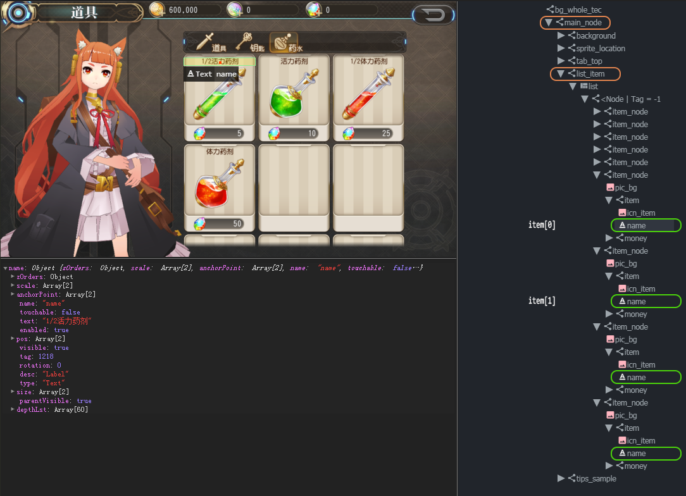

Advanced selections
===================

Selecting is very significant in specifying corresponding UI element in UI automated test. Under normal circumstances,
selecting by name is the simplest way. But in some cases the UI is not always named well, especially list-like
programmatically generated UI, which would not have a static name. Poco provides many powerful and effective ways to
select UI including by any existed attributes, hierarchy relationship and positional relationship. Most importantly,
any above ways can be chained or combined together to achieve more complicate selections.

The following examples will show how to select UI in complicate scenes.

.. code-block:: python

    # coding=utf-8

    from poco.drivers.unity3d import UnityPoco
    from airtest.core.api import connect_device

    connect_device('Android:///')
    poco = UnityPoco(('10.254.44.76', 5001))

    items = poco('main_node').child('list_item').offspring('name'):
    first_one = items[0]
    print(first_one.get_text())  # => '1/2活力药剂'
    first_one.click()
