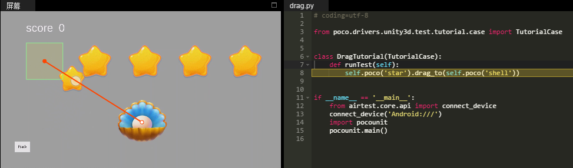

Drag and Swipe operations
=========================

Like click, drag and swipe are other types of actions on UI. **Drag** usually starts from and ends to specific UI, while
**Swipe** can be performed from any point to any point.

Drag
----

The following example shows how to swipe or drag the "star" to the "shell".

.. code-block:: python

    # coding=utf-8

    from poco.drivers.unity3d import UnityPoco
    from airtest.core.api import connect_device

    connect_device('Android:///')
    poco = UnityPoco(('10.254.44.76', 5001))

    # drag the "star" to the "shell"
    poco('star').drag_to(poco('shell'))

Swipe
-----

The following example shows how to scroll a list by using swipe.

.. code-block:: python

    # coding=utf-8

    from poco.drivers.unity3d import UnityPoco
    from airtest.core.api import connect_device

    connect_device('Android:///')
    poco = UnityPoco(('10.254.44.76', 5001))

    # swipe the list view up
    poco('Scroll View').swipe([0, -0.1])
    poco('Scroll View').swipe('up')  # the same as above, also have down/left/right
    poco('Scroll View').swipe('down')

    # perform swipe without UI selected
    x, y = poco('Scroll View').get_position()
    end = [x, y - 0.1]
    dir = [0, -0.1]
    poco.swipe([x, y], end)  # drag from point A to point B
    poco.swipe([x, y], direction=dir)  # drag from point A toward given direction and length

See also:

* `basic usage`_
* `interact with Buttons and Labels`_
* `drag and swipe operations`_
* `advanced selections`_
* `play with coordinate system and local positioning`_
* `iteration over elements`_
* `handling exceptions`_
* `waiting for events`_
* `play with unittest framework`_
* `optimize speed by freezing UI`_

.. _basic usage: basic.html
.. _interact with Buttons and Labels: interact_with_buttons_and_labels.html
.. _drag and swipe operations: drag_and_swipe_operations.html
.. _advanced selections: advanced_selections.html
.. _play with coordinate system and local positioning: play_with_coordinate_system_and_local_positioning.html
.. _iteration over elements: iteration_over_elements.html
.. _handling exceptions: handling_exceptions.html
.. _waiting for events: waiting_events.html
.. _play with unittest framework: play_with_unittest_framework.html
.. _optimize speed by freezing UI: optimize_speed_by_freezing_UI.html
