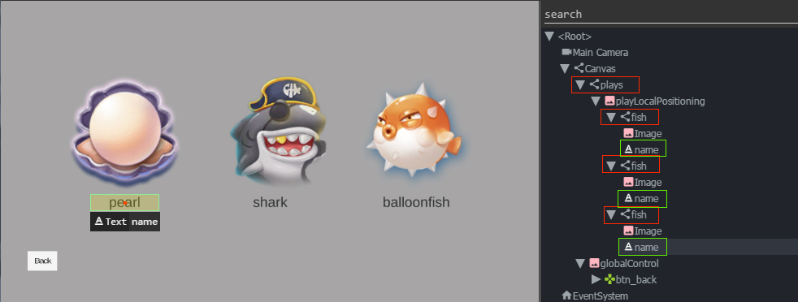

Iteration over elements
=======================

Poco provides the easiest way to interact with a serials of UI. That is to iterate over the selected UIs via for-loop.
In the loop, the iterator is also the the UI proxy. You can apply any method just like other selected UI.

The following example shows how to drag all stars to the shell. Yep it is the same example in homepage.

.. image:: ../img/overview.gif

.. code-block:: python

    # coding=utf-8

    import time
    from poco.drivers.unity3d import UnityPoco

    poco = UnityPoco()

    poco('btn_start').click()
    poco(text='drag drop').click()
    time.sleep(1.5)

    shell = poco('shell').focus('center')
    for star in poco('star'):
        star.drag_to(shell)
    time.sleep(1)

    assert poco('scoreVal').get_text() == "100", "score correct."
    poco('btn_back', type='Button').click()

Here is another example to iterate over all names of the model.

.. code-block:: python

    # coding=utf-8

    import time
    from poco.drivers.unity3d import UnityPoco

    poco = UnityPoco()

    for name in poco('plays').offspring('fish').child('name'):
        print(name.get_text())  # pearl/shark/balloonfish

The following example shows how to buy all merchandises on the current screen.

.. image:: img/g62-shop.png

.. code-block:: python

    # coding=utf-8

    poco = Poco(...)

    bought_items = set()
    for item in poco('main_node').child('list_item').offspring('name'):
        # get its text value
        item_name = item.get_text()

        # markdown the bought item
        if item_name not in bought_items:
            item.click()
            bought_items.add(item_name)

See also:

* `basic usage`_
* `interact with Buttons and Labels`_
* `drag and swipe operations`_
* `advanced selections`_
* `play with coordinate system and local positioning`_
* `iteration over elements`_
* `handling exceptions`_
* `waiting for events`_
* `play with unittest framework`_
* `optimize speed by freezing UI`_

.. _basic usage: basic.html
.. _interact with Buttons and Labels: interact_with_buttons_and_labels.html
.. _drag and swipe operations: drag_and_swipe_operations.html
.. _advanced selections: advanced_selections.html
.. _play with coordinate system and local positioning: play_with_coordinate_system_and_local_positioning.html
.. _iteration over elements: iteration_over_elements.html
.. _handling exceptions: handling_exceptions.html
.. _waiting for events: waiting_events.html
.. _play with unittest framework: play_with_unittest_framework.html
.. _optimize speed by freezing UI: optimize_speed_by_freezing_UI.html
