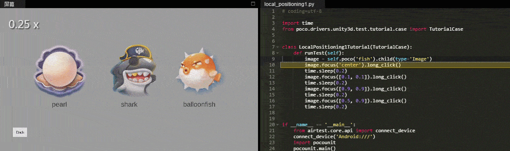
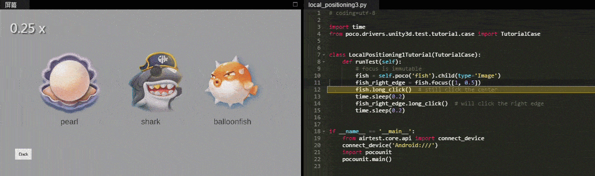
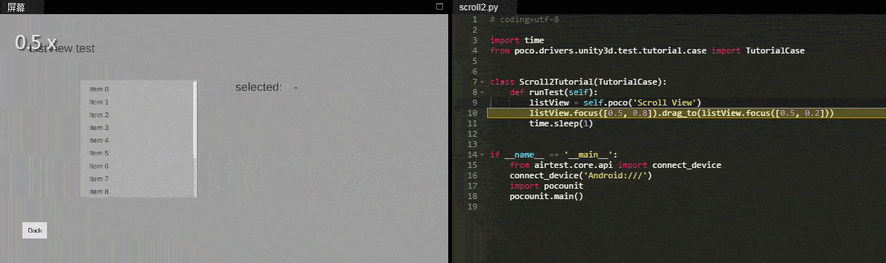

Play with coordinate system and local positioning
=================================================

In poco, coordinates are always normalized from 0 to 1. You can simply think of it the percentage size and positions.
In case that you need to interact with UI nearby or just want to click the button's edge rather than the center, you
can use local positioning by specifying a offset.

In general, to interact with UI always starts with a point, such as click or drag from the point. Local positioning
allows you to make any offset from the selected UI without selecting another UI.

.. image:: ../img/hunter-poco-coordinate-system.png

The following examples will show how to click different point inside selected UI. Please pay attention on
the red dot on the GIF underneath.

.. code-block:: python

    # coding=utf-8

    import time
    from poco.drivers.unity3d import UnityPoco
    from airtest.core.api import connect_device

    connect_device('Android:///')
    poco = UnityPoco(('10.254.44.76', 5001))

    image = poco('fish').child(type='Image')
    image.focus('center').long_click()
    time.sleep(0.2)
    image.focus([0.1, 0.1]).long_click()
    time.sleep(0.2)
    image.focus([0.9, 0.9]).long_click()
    time.sleep(0.2)
    image.focus([0.5, 0.9]).long_click()
    time.sleep(0.2)

Can also click outside the selected UI. It is very useful to click some models by its name tag. Please pay attention on
the red dot on the GIF underneath.

.. code-block:: python

    # coding=utf-8

    from poco.drivers.unity3d import UnityPoco
    from airtest.core.api import connect_device

    connect_device('Android:///')
    poco = UnityPoco(('10.254.44.76', 5001))

    balloonfish_image = poco(text='balloonfish').focus([0.5, -3])
    balloonfish_image.long_click()

The following examples show that ``focus`` is an immutable method that will not impact the origin UI. Please pay
attention on the red dot on the GIF underneath.

.. code-block:: python

    # coding=utf-8

    from poco.drivers.unity3d import UnityPoco
    from airtest.core.api import connect_device

    connect_device('Android:///')
    poco = UnityPoco(('10.254.44.76', 5001))

    # focus is immutable
    fish = poco('fish').child(type='Image')
    fish_right_edge = fish.focus([1, 0.5])
    fish.long_click()  # still click the center
    time.sleep(0.2)
    fish_right_edge.long_click()  # will click the right edge
    time.sleep(0.2)

The following example show how to scroll a list by using drag.

.. code-block:: python

    # coding=utf-8

    import time
    from poco.drivers.unity3d import UnityPoco
    from airtest.core.api import connect_device

    connect_device('Android:///')
    poco = UnityPoco(('10.254.44.76', 5001))

    listView = poco('Scroll View')
    listView.focus([0.5, 0.8]).drag_to(listView.focus([0.5, 0.2]))
    time.sleep(1)

See also:

* `basic usage`_
* `interact with Buttons and Labels`_
* `drag and swipe operations`_
* `advanced selections`_
* `play with coordinate system and local positioning`_
* `iteration over elements`_
* `handling exceptions`_
* `waiting for events`_
* `play with unittest framework`_
* `optimize speed by freezing UI`_

.. _basic usage: basic.html
.. _interact with Buttons and Labels: interact_with_buttons_and_labels.html
.. _drag and swipe operations: drag_and_swipe_operations.html
.. _advanced selections: advanced_selections.html
.. _play with coordinate system and local positioning: play_with_coordinate_system_and_local_positioning.html
.. _iteration over elements: iteration_over_elements.html
.. _handling exceptions: handling_exceptions.html
.. _waiting for events: waiting_events.html
.. _play with unittest framework: play_with_unittest_framework.html
.. _optimize speed by freezing UI: optimize_speed_by_freezing_UI.html
