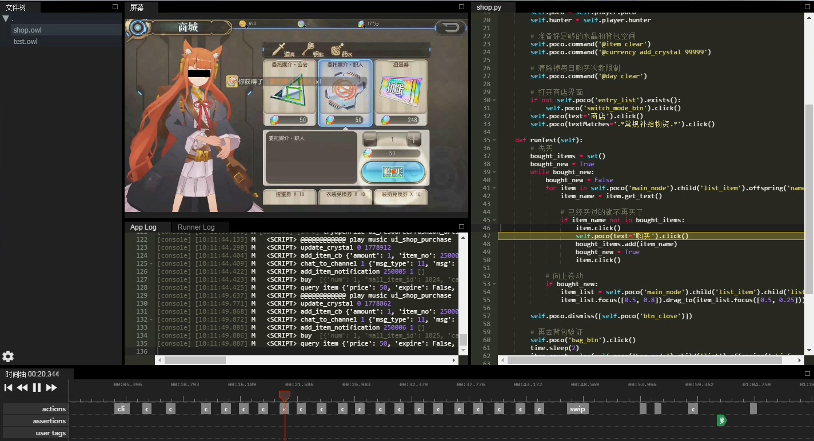

Play with unittest framework
============================

This section introduces a unittest framework (`pocounit`_) to make your test scripts **higher quality** and
**more manageable**. This unittest framework is fully compatible with Python standard library ``unittest``. To use
`pocounit`_, install from pip directly.

.. code-block:: bash

    pip install pocounit

`pocounit`_ provides a full set of assertion methods just like Python unittest and will record all details at runtime
of the test script. You can replay the test procedure after and see what's wrong with your test case.

`Get PocoTestResultPlayer`_

The following simple example shows how powerful of pocounit

.. raw:: html

    

        

            <video class="embed-responsive-item device-record" controls="" style="top: 0;bottom: 0;left: 0;width: 100%;height: 100%;border: 0;">
                <source src="http://top.gdl.netease.com/poco-res/video/result_player_demo.mp4" type="video/mp4">
            </video>
        

         
    

.. code-block:: python

    # coding=utf-8
    import time

    from pocounit.case import PocoTestCase
    from pocounit.addons.poco.action_tracking import ActionTracker
    from pocounit.addons.hunter.runtime_logging import AppRuntimeLogging

    class CommonCase(PocoTestCase):
        @classmethod
        def setUpClass(cls):
            super(CommonCase, cls).setUpClass()
            cls.poco = Poco(...)

            action_tracker = ActionTracker(cls.poco)
            cls.register_addin(action_tracker)

    class TestBuyShopItem(CommonCase):
        """
        去商城里把所有的道具都买一遍，验证所有道具都可以购买
        """

        def setUp(self):
            # 准备好足够的水晶和背包空间
            self.poco.command('***********')
            self.poco.command('***************************')

            # 清除掉每日购买次数限制
            self.poco.command('**********')

            # 打开商店界面
            if not self.poco('entry_list').exists():
                self.poco('switch_mode_btn').click()
            self.poco(text='商店').click()
            self.poco(textMatches='.*常规补给物资.*').click()

        def runTest(self):
            # 先买
            bought_items = set()
            bought_new = True
            while bought_new:
                bought_new = False
                for item in self.poco('main_node').child('list_item').offspring('name'):
                    item_name = item.get_text()

                    # 已经买过的就不再买了
                    if item_name not in bought_items:
                        item.click()
                        self.poco(text='购买').click()
                        bought_items.add(item_name)
                        bought_new = True
                        item.click()

                # 向上卷动
                if bought_new:
                    item_list = self.poco('main_node').child('list_item').child('list')
                    item_list.focus([0.5, 0.8]).drag_to(item_list.focus([0.5, 0.25]))

            self.poco.dismiss([self.poco('btn_close')])

            # 再去背包验证
            self.poco('btn_bag').click()
            time.sleep(2)
            item_count = len(self.poco('bag_node').child('list').offspring('obj_frame_spr'))
            self.assertEqual(item_count, len(bought_items), '购买道具总数量验证')

        def tearDown(self):
            # 关掉界面
            self.poco.dismiss([self.poco('btn_close')])

    if __name__ == '__main__':
        import pocounit
        pocounit.main()

See also:

* `basic usage`_
* `interact with Buttons and Labels`_
* `drag and swipe operations`_
* `advanced selections`_
* `play with coordinate system and local positioning`_
* `iteration over elements`_
* `handling exceptions`_
* `waiting for events`_
* `play with unittest framework`_
* `optimize speed by freezing UI`_

.. _basic usage: basic.html
.. _interact with Buttons and Labels: interact_with_buttons_and_labels.html
.. _drag and swipe operations: drag_and_swipe_operations.html
.. _advanced selections: advanced_selections.html
.. _play with coordinate system and local positioning: play_with_coordinate_system_and_local_positioning.html
.. _iteration over elements: iteration_over_elements.html
.. _handling exceptions: handling_exceptions.html
.. _waiting for events: waiting_events.html
.. _play with unittest framework: play_with_unittest_framework.html
.. _optimize speed by freezing UI: optimize_speed_by_freezing_UI.html

.. _Get PocoTestResultPlayer: ../about-test-result-player.html
.. _pocounit: https://github.com/AirtestProject/PocoUnit
