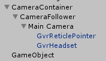
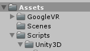

Automating virtual reality with AirtestIDE:
===========================================

Introduction
------------
One of the most recent technologies widely used in gaming is virtual reality.

AirtestIDE currently support unity automation, but there are some actions that are unique from virtual reality that needed special support.

For example, for Google VR, clicking on an object is no longer a right action. Instead, the camera should look at this object and then perform a click anywhere in the screen.

Camera manipulation is a must for VR automation. 

SteamVR supports hand devices that would point and perform the action on the objects, so again, the previous automation of ‘clicking’ on an object is not longer enough for VR automation.

Last but not least, unity is not the only tool to create VR applications, so we would like to support other platforms as well, such as WebVR.

Version 1: Google VR support
----------------------------

As stated in the introduction, automating actions on Google VR requires an initial camera movement. 

Airtest supports a combination of Unity and Android for automating Google VR. We are not currently supporting DayDream.

On the new unity versions, this movement is only allowed after embedding the camera in an object and performing the action on such object.

The first thing to do is to add the Airtest “Unity3D” folder inside of your project as with any other unity automation with Airtest.

Then add a new empty object and add the “Poco Manager” script to this object.

You also need to have two objects to contain your camera, in our example, we called it “CameraContainer” and “CameraFollower”. This is because of GoogleVR’s policies of allowing the user to be in charge of the camera at all points. We need a camera container to move the camera (as per these policies we cannot move it on our own) and another one to follow the camera movements so we can move from the current camera position rather than the container’s.

In the scene should look like this:

And the project:

Next, we can start creating the scripts with AirtestIDE. As with other AirtestIDE add the following lines: 
.. code-block:: python

	import sys
	from airtest.core.api import *
	import time
	from poco.drivers.unity3d import UnityPoco
	import poco
	auto_setup(__file__)	
	poco = UnityPoco() # note: use device=UnityEditorWindow() to test in unity
	vr = poco.vr
	uiproxy = poco()

Airtest supports two ways of rotating the camera :

1) Indicating the degrees that you wish to rotate on each direction and the object to which apply this rotation. You can optionally indicate the speed of the rotation (by default is 0.125) which would simulate more realistically a head turn.
.. code-block:: python

	vr.rotateObject(-10,0,0,'CameraContainer', ‘cameraFollower’, 0.5)

2) Indicating the name of the object that the camera should be looking at, and the object to which apply this rotation. Speed can be added optionally as well.
.. code-block:: python

	vr.objectLookAt('Cube', 'CameraContainer', ‘cameraFollower’ , 5)

Once the camera is looking at the right object, we can perform a random click on the Android screen in the following way:
.. code-block:: python

	poco.click([0.5, 0.5])

However, please notice that when we perform above actions, since we are adding speed, it is possible that the object was still not located when the click was performed. 

In order to ensure that there are no commands pending on execution by the time the click is performed, we should introduce some sort of loop that we would escape if the action takes longer than expected:
.. code-block:: python

	count = 1
	while vr.checkIfUnityFinished() != True and count < 10:
    	sleep(10)
    	count = count + 1
    	print("loop")

The method “uiproxy.checkIfUnityFinished()” returns true once the unity queue has no more commands to execute, meaning that the position desired was reached. You only need to do verify this before an action such click or assert, but not between rotations as the unity code would control this.

Last, we should add some assertions. For example, if the object is visible, if the pointer is active, if the object changed color, if the position of the camera have changed (which would be useful for Waypoints) ...

For example, we check the cube texture at the beginning of the script (after the object is located for better results) to save the object’s texture:
.. code-block:: python

	texture = poco('Cube').attr('texture')
	
After that, we would like to assert a change of texture, or perhaps that it changed to the color we wanted:
.. code-block:: python

	assert poco('Cube').attr('texture') != texture
	assert poco('Cube').attr('texture') == "RGBA(0.000, 0.000, 1.000, 1.000)"

Version 2: SteamVR support
--------------------------
SteamVR supports hand devices that would point and perform the action on the objects, so again, the previous automation of ‘clicking’ on an object is not longer enough for VR automation.

We are currently working on the support for this automation, stay tuned in.

Version 3: WebVR
----------------
WebVR provide the means of creating virtual applications and games embedded on a website.

Airtest is an open source project and as such, collaborates with selenium for this automation.

As before, currently, we have several possibilities here (https://webvr.info/):

1) Google Cardboard: Works best with Chrome on Android devices. You can still experience WebVR content in other browsers on Android and iOS, but it might not be as smooth since those browsers don’t fully support WebVR. 
2) Daydream: Works with Chrome on Daydream-ready Android devices. 
3) Samsung Gear VR: Works with Oculus Browser and Samsung Internet. 
4) Oculus Rift: Works with Firefox and Supermedium on Windows. 
5) Oculus Go: Works with Oculus Browser. 
6) HTC Vive: Works with Firefox, Servo, and Supermedium on Windows. On macOS, you can use Firefox Nightly. 
7) Windows Mixed Reality headsets: WebVR v1.1 is supported by Microsoft Edge on Windows. Firefox and Supermedium are also supported with SteamVR. 

This is not yet supported by AirtestIDE but we wish to add its support in the near future.

